# 🎬 CineBooker

A full-stack movie ticket booking application inspired by BookMyShow, allowing users to browse movies, select theatres, choose seats, and complete payments seamlessly.

---

## 🚀 Features

* 🌍 City-based movie selection
* 🎬 Browse movies with filters (language, genre)
* 📄 Movie details with description & reviews
* 🏢 Theatre & showtime selection
* 🪑 Interactive seat selection system
* 💳 Multiple payment options (Card / UPI)
* 🎟️ Ticket generation with QR code

### 🔐 Admin Features
* 🔑 Secure admin login
* 🎬 Add / Edit / Delete movies
* 🏢 Manage theatres
* 🎥 Create shows and generate seats

---

## 🛠️ Tech Stack

* **Frontend:** React.js, CSS
* **Backend:** Node.js, Express.js
* **Database:** MySQL

---

## 📁 Project Structure

```
bookmyshow-clone     → Backend
bookmyshow-frontend  → Frontend
```

---

## 📸 Screenshots

### 🌍 City Selection

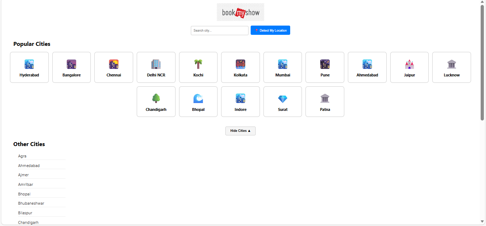

---

### 🎬 Movies Listing


---

### 🎥 Movie Details

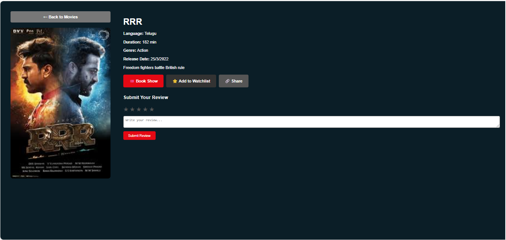

---

### 🏢 Theatre Selection

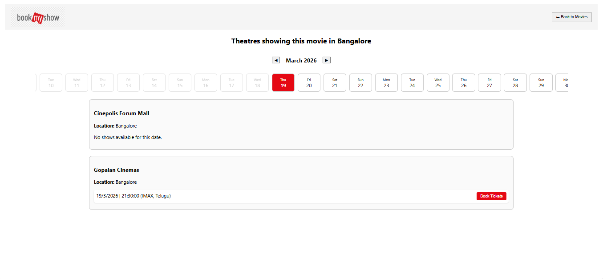

---

### 🪑 Seat Selection Popup

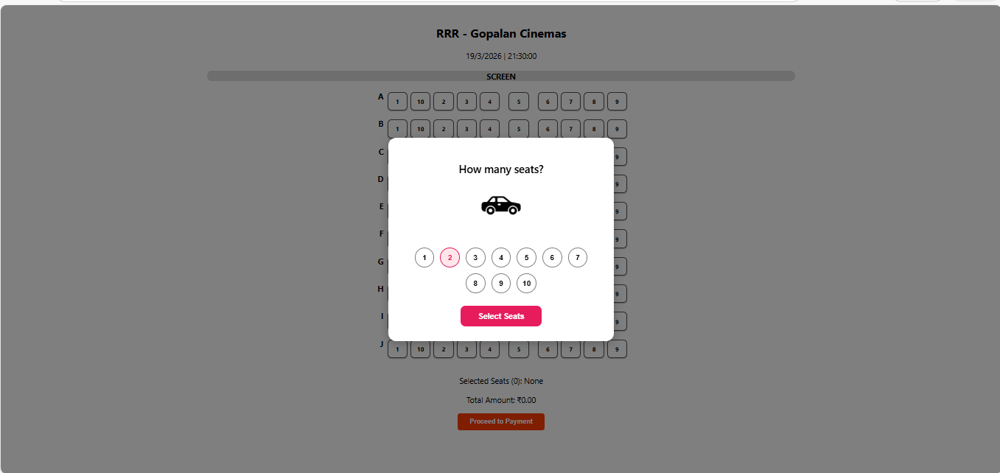

---

### 🪑 Seat Layout

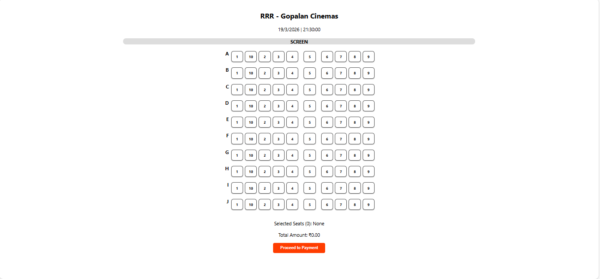

---

### 💳 Payment Page


---

### 💳 Card Payment

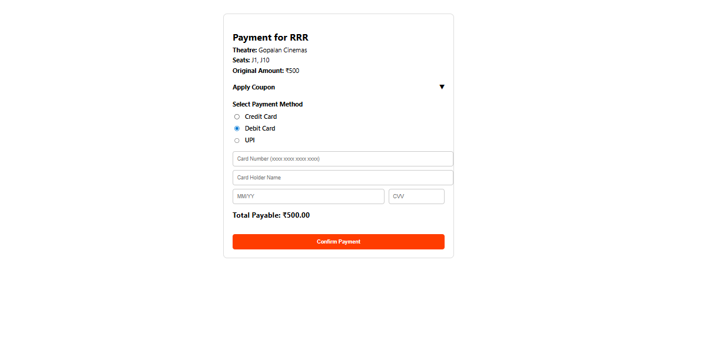

---

### 💳 UPI Payment

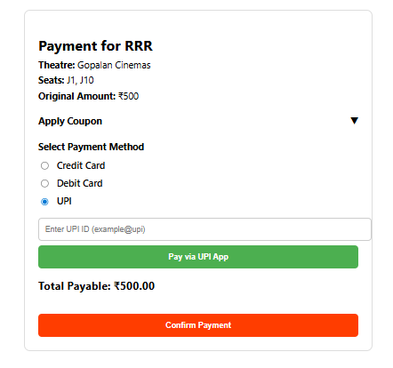

---

### 💳 Payment Confirmation

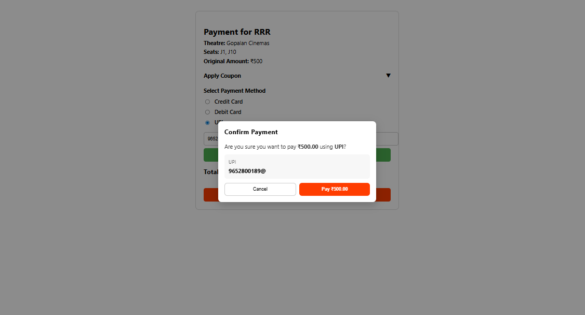

---

### 🎟️ Ticket Page

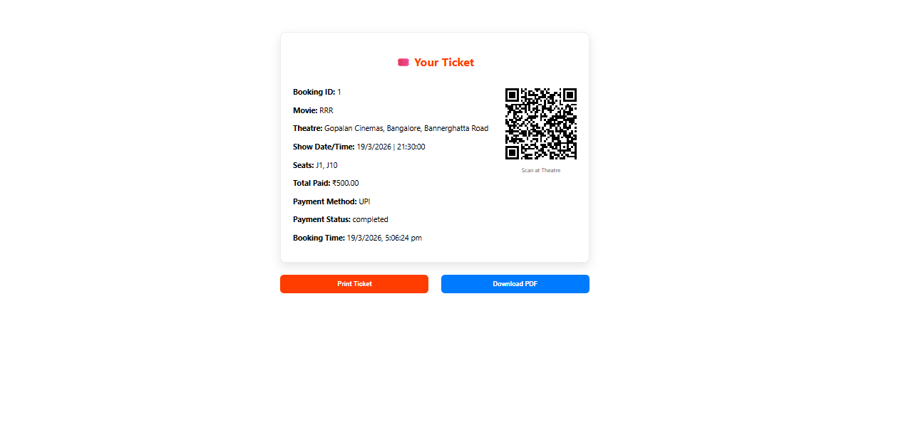

---
## 🔐 Admin Module

## 🏠 User Home
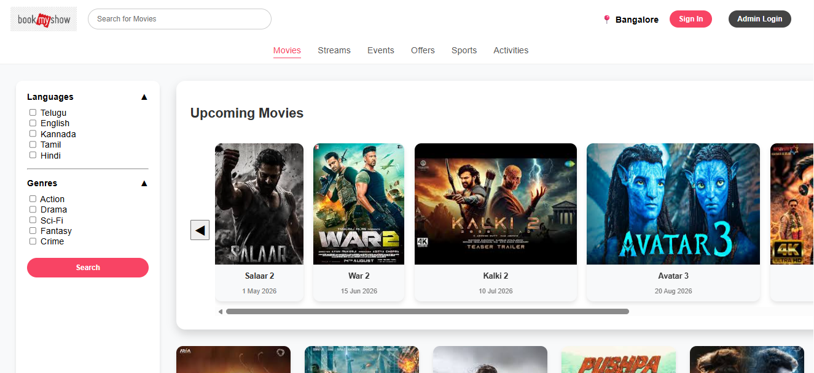


### 🔑 Admin Login
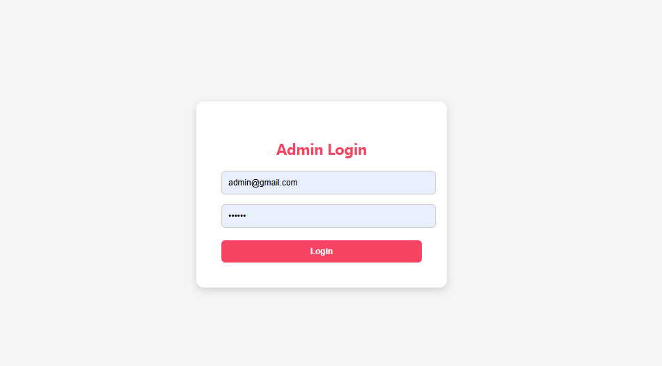

### 🎬 Admin Dashboard - Movies
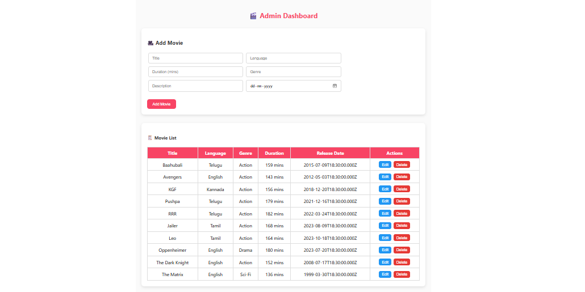

### 🏢 Admin Dashboard - Theatres & Shows
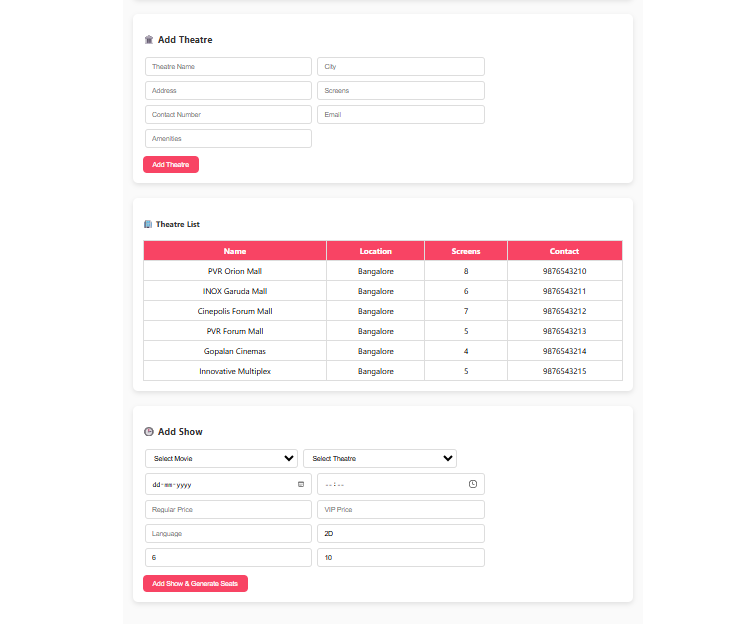

---


## ⚙️ Installation & Setup

### 1️⃣ Clone the repository

```
git clone https://github.com/pamuruprathima/CineBooker.git
```

### 2️⃣ Backend setup

```
cd bookmyshow-clone
npm install
npm start
```

### 3️⃣ Frontend setup

```
cd bookmyshow-frontend
npm install
npm start
```

---

## 💡 Future Improvements

* 👤 User authentication (login/signup for users)
* 📱 Mobile responsive UI
* 🎫 Booking history for users
* 📧 Email ticket confirmation
* 🔒 Role-based access (Admin/User separation enhancement)

---

## 👩‍💻 Author

**Prathima Pamuru**
