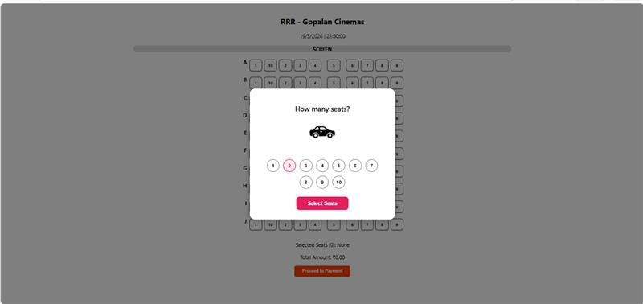
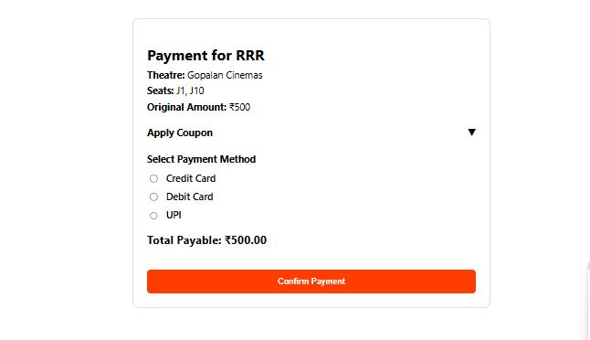
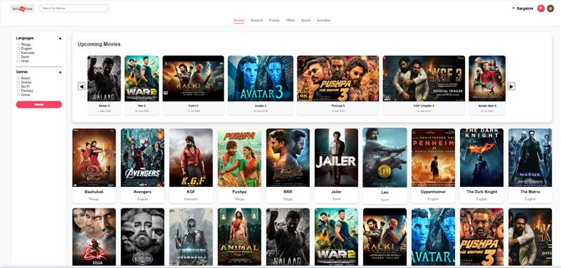
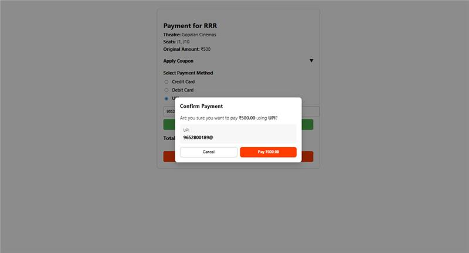

# 🎬 CineBooker

A full-stack movie ticket booking application inspired by BookMyShow.

## 🚀 Features
- City-based movie browsing
- Movie details & show timings
- Seat selection system
- Payment (UPI/Card)
- Ticket generation with QR code

## 🛠️ Tech Stack
- React.js
- Node.js
- Express.js
- MySQL

## 📁 Project Structure
- bookmyshow-clone → Backend
- bookmyshow-frontend → Frontend

## 📸 Screenshots

### Home Page

### Movies Page

### Movie Details

### Theatre Selection

### Seat Selection

### Payment Page

### Ticket Page

